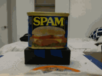

# Team ICARUS: May 2025 Robot Hackathon Repository

**ICARUS** (**I**ntelligent **C**omputer-**A**ssisted **R**obotic **U**nmanned **S**cout) is an autonomous drone system for object recognition.

> **Note**  
> This repository uses the pinned version of `tbp.monty == 0.5.0`. For an example that uses a fork of Monty, please see [Everything is Awesome 2025 Robot Hackathon Repository](https://github.com/thousandbrainsproject/everything_is_awesome). 

## Project Overview

We've developed an interface between the DJI Tello drone and Monty framework for autonomous object recognition and tracking.

> **Warning**  
> This project is currently under development. Below are detailed instructions for getting started and planned next steps.

## Getting Started

### About the Drone
- We use the DJI Tello drone (manufactured by Ryze Tech) with a 5MP camera. You can find similar models on [eBay](https://www.ebay.com/itm/304925257294).
- For manual flight testing, we recommend downloading the official Tello app (available on Android and iOS).
- For programmatic control, we use [DJITelloPy](https://github.com/damiafuentes/DJITelloPy) (included in `environment.yml`).
- Reference: [Tello SDK 2.0 Manual](https://dl-cdn.ryzerobotics.com/downloads/Tello/Tello%20SDK%202.0%20User%20Guide.pdf)

> **Important**  
> - Your computer must be connected to the drone's WiFi network (`TELLO-xxxx`) to control it. Note that you won't have internet access while connected to the drone.
> - If connection issues occur, try disabling your computer's Bluetooth.

### Installation

This project uses [conda](https://www.anaconda.com/download) for environment management. Choose the appropriate installation commands based on your system:

To create the environment, run:

#### ARM64 (Apple Silicon) (zsh shell)
```
conda env create -f environment.yml --subdir=osx-64
conda init zsh
conda activate drone
conda config --env --set subdir osx-64
```

#### ARM64 (Apple Silicon) (bash shell)
```
conda env create -f environment.yml --subdir=osx-64
conda init
conda activate drone
conda config --env --set subdir osx-64
```

#### Intel (zsh shell)
```
conda env create -f environment.yml
conda init zsh
conda activate drone
```

#### Intel (bash shell)
```
conda env create -f environment.yml
conda init
conda activate drone
```

## Project Components

This project is currently a work in progress. Here's what you can do with the current codebase:

### 1. Sample Dataset Processing
- A sample dataset is provided under `dataset/potted_meat_can_v4` for development and testing. It is an "offline" dataset that was created under controlled conditions and with known ground-truth object and drone locations and poses.
- Follow the detailed instructions in [data_processing.md](data_processing.md) to:
  - Process the raw images
  - Generate depth information
  - Add precomputed agent positions to the dataset.
  - Create 3D point clouds that can be used with Monty for object recognition

### 2. Available Components
- The codebase includes several implemented components:
  - Custom dataloaders for handling drone imagery
  - Environment configurations for Monty integration
  - Basic drone control interfaces using DJITelloPy
  - Vision processing utilities in `tbp/drone/src/vision`.

### 3. Current Limitations
- The project is not yet running end-to-end
- Main challenges we're working on:
  - Retrieving accurate location and pose data from drone imagery
  - Constructing coherent 3D point clouds from multiple viewpoints and mapping them into world coordinates.    
  - Building out the environment/dataset/dataloader pipeline. Until this is complete, we won't have runnable monty experiments. In particular, we need to implement the 'saccade-over-image' behavior used in other environments.
  - Integration with Monty's object recognition pipeline

### 4. Development Roadmap
- [ ] Enhance patch extraction and drone location from drone imagery and telemetry
- [ ] Optimize 3D point cloud construction and mapping into world coordinates
- [ ] Complete Monty integration by building out the environment/dataset/dataloader pipeline
- [ ] Extend the code to enable on-line Monty and drone usage
- [ ] Implement comprehensive testing suite
- [ ] Add validation metrics

## Contributing
For questions, bug reports, or contributions, please open an issue or submit a pull request.

## License
This project is licensed under the MIT License. See [LICENSE](LICENSE) for details.


